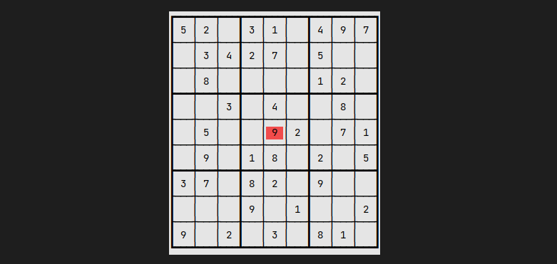

  <h1 align="center"> Sudoku </h1>
  
 Play sudoku on your terminal! 

  
  

## Introduction

Sudoku is one of the most popular puzzle games of all time. The goal of Sudoku is to fill a 9×9 grid with numbers so that each row, column and 3×3 section contain all of the digits between 1 and 9.

## How To Play

| Key    | Action       |
| ------ | ------------ |
| &larr; | move left    |
| &rarr; | move right   |
| &darr; | move down    |
| &uarr; | move up      |
| 1..9   | insert value |
| e      | remove value |
| ESC    | open menu    |
| Ctrl+Z | quit         |

## License

Released under the [MIT](LICENSE) license.
